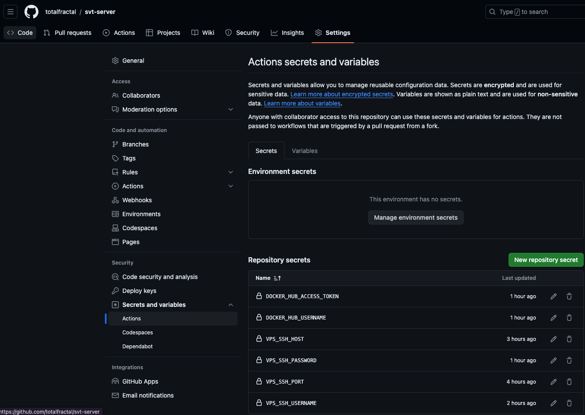

<p align="center">
  <a href="http://nestjs.com/" target="blank"></a>
</p>

[circleci-image]: https://img.shields.io/circleci/build/github/nestjs/nest/master?token=abc123def456
[circleci-url]: https://circleci.com/gh/nestjs/nest

  <p align="center">A progressive <a href="http://nodejs.org" target="_blank">Node.js</a> framework for building efficient and scalable server-side applications.</p>
    <p align="center">
<a href="https://www.npmjs.com/~nestjscore" target="_blank"></a>
<a href="https://www.npmjs.com/~nestjscore" target="_blank"></a>
<a href="https://www.npmjs.com/~nestjscore" target="_blank"></a>
<a href="https://circleci.com/gh/nestjs/nest" target="_blank"></a>
<a href="https://coveralls.io/github/nestjs/nest?branch=master" target="_blank"></a>
<a href="https://discord.gg/G7Qnnhy" target="_blank"></a>
<a href="https://opencollective.com/nest#backer" target="_blank"></a>
<a href="https://opencollective.com/nest#sponsor" target="_blank"></a>
  <a href="https://paypal.me/kamilmysliwiec" target="_blank"></a>
    <a href="https://opencollective.com/nest#sponsor"  target="_blank"></a>
  <a href="https://twitter.com/nestframework" target="_blank"></a>
</p>
  <!--[](https://opencollective.com/nest#backer)
  [](https://opencollective.com/nest#sponsor)-->

## Description

[Nest](https://github.com/nestjs/nest) framework TypeScript starter repository.

## Installation

```bash
$ npm install
```

## Running the app

```bash
# development
$ npm run start

# watch mode
$ npm run start:dev

# production mode
$ npm run start:prod
```


## VPS

To deploy to VPS, need to do some things:

First - connect to VPS and create a folder

```bash
# Login with shh
$ ssh '${{ secrets.VPS_SSH_USERNAME }}'@'${{ secrets.VPS_SSH_HOST }}'

# Create folder
$ mkdir /home/'${{ secrets.VPS_SSH_USERNAME }}'/svt-docker-dev-deploy/
```
Ok, close ssh session.
Second - download docker-compose.server.dev.yml to VPS

```bash
# Создайте папку 
$ scp /Users/totalfractal/NodeProjects/svt-server/docker-compose.server.dev.yml root@188.225.47.232:/home/drngk/mhph-docker-dev-deploy/svt-docker-dev-deploy

# Покиньте ssh и
$ docker-compose -f docker-compose.actions.dev.yml up --force-recreate --build --no-deps -d
```

## Postgres

1. В `.env` файлах нужно указать настройки и доступ к Postgres-серверу.
2. Нужно создать базу данных в Postgres, название которой указано в `.env` файле.
3. Вероятно, придется поправить некоторые ошибки, которые возникают во время выполнения запросов. Например, могу  вохникнуть "фантомные" ключи, из-за того, что была криво настроена схема бд через ORM код.

## Actions

На странице настроек проекта GitHub, 
Settings -> Security -> Secrets and variables -> Actions 
нужно добавить следующие данные:
- DOCKER_HUB_ACCESS_TOKEN
- DOCKER_HUB_USERNAME
- VPS_SSH_HOST
- VPS_SSH_PASSWORD
- VPS_SSH_PORT
- VPS_SSH_USERNAME



## Docker

```bash
# run local docker image
$ docker-compose -f docker-compose.local.dev.yml up --force-recreate --build --no-deps -d

# run server docker image
$ docker-compose -f docker-compose.server.dev.yml up --force-recreate --build --no-deps -d

# run actions docker image
$ docker-compose -f docker-compose.actions.dev.yml up --force-recreate --build --no-deps -d
```
